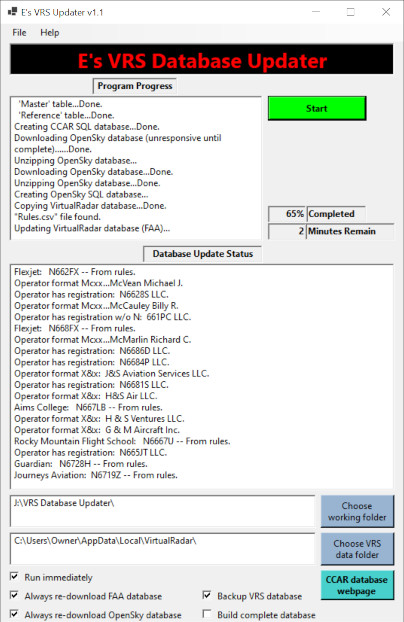

# E's VRS Database Updater

This program will comprehensively update [Virtual Radar Server's](https://github.com/vradarserver/vrs/releases) (VRS) aircraft database.  The database will be updated with the most recent U.S. [FAA registration database](https://www.faa.gov/licenses_certificates/aircraft_certification/aircraft_registry/releasable_aircraft_download/) and, if provided, the most recent [Canadian CCAR registration database](https://wwwapps.tc.gc.ca/saf-sec-sur/2/ccarcs-riacc/DDZip.aspx).  The updates to the VRS database include the legally recognized owner ("operator"), manufacturer, model, type and ICAO model code of each aircraft.  Additionally, aircraft models will be more specifically defined in the VRS database so you will see more diverse icons and silhouettes on the map and aircraft list within VRS.  

I wrote this program since I didn't like seeing "Private" for so many aircaft when using Virtual Radar Server.  You will no longer see "Private" for any registered US or Canadian registered aircraft and the details for all aircraft will be complete.  The FAA database generally doesn't concern itself with proper capitalization for proper names, acronyms or when the registration of the aircraft is part of the owner name.  I make an attempt to fix this so the VRS database looks cleaner.

Any field in VRS's database can be modified based on a CSV-defined rules file (an explanation on the format of that file is below).  For example, you can create unique operator codes for certain aircraft in order to use your own flag images for specific aircraft.  In my case, I created unique operator flags using the logos for the local "flight for life" and medivac aircraft (e.g., Guardian, Reach, Air Methods, *etc.*), local flight school aircraft, certain business aircraft (*e.g.*, Flexjet and WheelsUp), local fire fighting aircraft and military aicraft (*e.g.*, USAF).  I also assign a unique operator flag to my own aircraft.  For unique operator flags that I create, I generally use operator codes that end in "0" to avoid conflicting with ICAO-defined codes (*e.g.*, "UC0" for UC Health Lifeline helicopters).  Also, in many cases, VRS's database doesn't properly assign operator codes to some airlines, so I refresh those to ensure the operator flags are properly shown (*e.g.*, for United, Delta and Southwest).

By default, the program automatically downloads the most recent FAA registration database.  If you want to use the Canadian CCAR registration database, you must download that manually.  Since I am located in the US far from the Canadian border, I only update my local copy of the Canadian database every few months.

By default, the program will make a backup of your VRS database.  So if this program corrupts VRS's database (I have yet to see this happen), you can revert to the original copy of the database.  The filename of the backup includes the date and time of when the backup is made.

To support being part of a scheduled task, the program has the option to automatically start updating the database as soon as it's run.  In my case, I run this program early Sunday morning to keep my VRS database updated with the most recent registration data from the FAA and to ensure that newly entered aircraft in VRS's database are also updated.  

In many cases, the ICAO model codes for aircraft aren't assigned in the VRS database.  This leads to there being no aircraft silhouette on VRS's aircraft list and a generic aircraft icon on the map.  Thus this program updates ICAO model codes based on my personal database of tracking aircraft for years.  Over these years, I've been manually mapping aircraft to their ICAO model code.  This mapping database is hard-coded into the program.  However you can instead use a CSV-defined file to map aircraft to the ICAO model code.  An explanation on the format of that file is below.  Because the aircraft "ecosystem" where I live will be different than other locations, you may want to supplement my model-to-ICAO code mapping if many model codes are missing in your database.

I don't know if this program will run within mono.  If you run Virtual Radar Server on a Linux box, you can copy your "AircraftOnlineLookupCache.sqb" file to a Windows box and run this program on that Windows box.  After the program is done processing the database, you can copy the database file back to your Linux box.

I'm not a programmer. I wrote this for myself, figuring it out as I went along.  The code isn't very robust.  I didn't intend to share it however I believe it might have some value to the community.  

Finally, there's no reason to run the program more than once-a-week in my experience.  Even though I live within sight of one of the busiest airports in the world, the number of new aircraft that enter my VRS's database each week is relatively low.  If you need to run the program frequently, perhaps use the option not to download the FAA database each time so as not to unnecessarily burden the FAA's server.

<ins>**Rules.csv file format explanation**</ins>

This file is not necessary but will help you modify VRS's database as you like.  

Each row corresponds to a single rule and is given a number.  The rule number is ignored and is for human readability only.  There are three groups of columns in the CSV file.  The first group is the data field(s) to match for aircraft whose details you want to change in VRS's database.  The second group, separate from the first by three empy columns, are the fields that you want to change when the previous field(s) match(es).  The last group are two columns that define 1) the message you want to show in the program's status window when that row's rule is matched (headed "Message") and 2) the field to show in that message (headed "from db"). 

When you use an exclamation point ("!") in a rule, that indicates to be exclusive.  For example if you use "!SWA" in the "OperatorICAO" field, that means not to execute that rule if the "OperatorICAO" is "SWA".  *If you use an exclusive rule, be sure to also use an inclusive rule to avoid changing the fields for aircraft that don't match the exclusive rule.*

Examples of how I use rules:
- Create unique ICAO operator codes for local aircraft so I can have my own unique operators flags based on company logos of flight schools, friends, *etc.*.  Shown in rules 1-16 and others in the included [Rules.csv](Rules.csv) file.
- Update the operator string to have proper capitalization (*e.g.*, the FAA database will show "Atp Aircraft" but I prefer "ATP Aircaft").   Shown in rule 26 in the included [Rules.csv](Rules.csv) file.
- Assign operator codes to entire fleets to ensure VRS is accurate (*e.g.*, all Southwest planes that aren't defined as SWA should be have the SWA operator code).  Shown in rules 17 and 41 in the included [Rules.csv](Rules.csv) file.
- Assign proper operator codes to aircraft whose registrations don't indicate their operators (*e.g.*, "Cbg LLC" is Key Lime Air so the operator code should be LYM).  Shown in rules 54 and 62 in the included [Rules.csv](Rules.csv) file.

<ins>**Sils.csv file format explanation**</ins>

This file is not necessary since its contents are hard-coded into the program.  However, you can modify or add to the file to override the hard-coded silhouette mapping data.  When this file is provided to the program in the working folder, the hard-coded data are not used.  

There are four columns.  The first column defines the manufacturer(s), the second defines the model(s), the third column defines the ICAO model code to use based on matching the manufacture and model.  The fourth column is the model code used by the ICAO.  This is what defines the silhouette that VRS will use.  The fourth and third columns are almost always the same, however if there's need to remap an aircraft differently than the ICAO-defined one, having the third column supports using a different code.

For each aircraft in the VRS database, the program goes through each row of the [Sils.csv](Sils.csv) file and looks to match the aircraft's manufacturer with the entries in the first column.  If it finds a match, it then looks to match the model of the aircraft with the model(s) listed on that row.  If it finds a match, it uses the the "Remap" entry in that row to assign the ICAO model code in VRS's database.
 
The manufacturer and model entries can be comma-delimited lists.  A wildcard (*) in the manufacturer field can be used to tell the program to test each aicraft against that row regardless of the manufacuturer (this is especially useful for kit aircraft where the manufacturer is not standardized).  Similarly, a wildcard in the model field would tell the program, once the manufacturer was matched, to match all aircraft and assign the ICAO code given regardless of the model.  Thus do not use a wildcard for both the manufacturer *and* model on the same row, lest every aircraft be matched to that row and all aircraft in VRS's database would have the same ICAO model code.