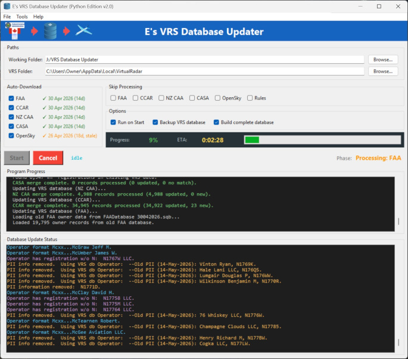

# E's VRS Database Updater

This program will comprehensively update [Virtual Radar Server's](https://github.com/vradarserver/vrs/releases) (VRS) aircraft database.  The database will be updated with the most recent U.S. [FAA registration database](https://www.faa.gov/licenses_certificates/aircraft_certification/aircraft_registry/releasable_aircraft_download/), [the OpenSky database](https://opensky-network.org/datasets/metadata/) the most recent Canadian CCAR, New Zealand CAA and Austrial CASA databases.  The updates to the VRS database include the legally recognized owner ("operator"), manufacturer, model, type and ICAO model code of each aircraft.  Additionally, aircraft models will be more specifically defined in the VRS database so you will see more diverse icons and silhouettes on the map and aircraft list within VRS.  

I wrote this program since I didn't like seeing "Private" for so many aircraft when using Virtual Radar Server.  You will no longer see "Private" for any registered US or Canadian registered aircraft and the details for all aircraft will be complete.  The FAA database generally doesn't concern itself with proper capitalization for proper names, acronyms or when the registration of the aircraft is part of the owner name.  I make an attempt to fix this so the VRS database looks cleaner.

Any field in VRS's database can be modified based on a CSV-defined rules file (an explanation on the format of that file is below).  For example, you can create unique operator codes for certain aircraft in order to use your own flag images for specific aircraft.  In my case, I created unique operator flags using the logos for the local "flight for life" and medivac aircraft (e.g., Guardian, Reach, Air Methods, *etc.*), local flight school aircraft, certain business aircraft (*e.g.*, Flexjet and WheelsUp), local fire fighting aircraft and military aircraft (*e.g.*, USAF).  I also assign a unique operator flag to my own aircraft.  For unique operator flags that I create, I generally use operator codes that end in "0" to avoid conflicting with ICAO-defined codes (*e.g.*, "UC0" for UC Health Lifeline helicopters).  Also, in many cases, VRS's database doesn't properly assign operator codes to some airlines, so I refresh those to ensure the operator flags are properly shown (*e.g.*, for United, Delta and Southwest).

The program downloads each register you tick under Auto-Download, and it now does so for all five — FAA, CCAR, NZ CAA, CASA and OpenSky.  The Canadian CCAR download no longer has to be fetched by hand.  Each register also has its own age limit, so a copy younger than that limit is reused rather than downloaded again; set a register to 0 days to always download it.  Since I am located in the US far from the Canadian border, I only refresh my copy of the Canadian database every few months, which the age limit handles on its own.

By default, the program will make a backup of your VRS database.  So if this program corrupts VRS's database (I have yet to see this happen), you can revert to the original copy of the database.  The filename of the backup includes the date and time of when the backup is made.

You can also build a complete database so that aircraft not yet seen by VRS are included in its database.  This supports offline usage of VRS (to use, for example, with [VRS on Stratux](https://github.com/egite/Virtual-Radar-Server-on-Stratux) in the air) and avoids having to wait until you do an update to get registration data for aircraft not yet seen.

To support being part of a scheduled task, the program has the option to automatically start updating the database as soon as it's run.  In my case, I run this program early Sunday morning to keep my VRS database updated with the most recent registration data from the FAA and to ensure that newly entered aircraft in VRS's database are also updated.  

In many cases, the ICAO model codes for aircraft aren't assigned in the VRS database.  This leads to there being no aircraft silhouette on VRS's aircraft list and a generic aircraft icon on the map.  Thus this program updates ICAO model codes based on my personal database of tracking aircraft for years.  Over these years, I've been manually mapping aircraft to their ICAO model code.  This mapping database is hard-coded into the program.  You can also use a CSV-defined file that layers on top of it, letting you change, add to, or switch off individual mappings without replacing the rest.  An explanation on the format of that file is below.  Because the aircraft "ecosystem" where I live will be different than other locations, you may want to supplement my model-to-ICAO code mapping if many model codes are missing in your database.

**Both CSV files can now be edited inside the program — you no longer need a spreadsheet.**  **Tools → Rules Editor** and **Tools → Silhouette Editor** understand what each column means, check your entries as you type, warn about entries that can never match, and let you test a rule or a silhouette mapping against your actual database before you save.  Each editor keeps a backup of the previous version of the file.  The formats are unchanged, so you can still edit the files by hand if you prefer, and files edited either way work in both.

The program includes a full user manual under **Help → User Manual**, covering everything below in more detail — the main window, how an update runs, rules, silhouettes, the working folder, and troubleshooting.  It can be searched, and saved out to a text file.

The download address for each register is set in **File → Settings**.  If a register moves its file in the future, you can update the address there.  The program also keeps count of consecutive failed downloads for each register, and tells you when one has failed often enough that its address is likely wrong.

I don't know if this program will run within mono.  If you run Virtual Radar Server on a Linux box, you can copy your "AircraftOnlineLookupCache.sqb" file to a Windows box and run this program on that Windows box.  After the program is done processing the database, you can copy the database file back to your Linux box.

Finally, there's no reason to run the program more than once-a-week in my experience.  Even though I live within sight of one of the busiest airports in the world, the number of new aircraft that enter my VRS's database each week is relatively low.  If you need to run the program frequently, perhaps use the option not to download the FAA database each time so as not to unnecessarily burden the FAA's server.

Version 2.0 and later is a Python port of the original hand-written VB.NET program, with added capabilities and a number of optimizations.  It does everything the original did and uses the same [Rules.csv](Rules.csv) and [Sils.csv](Sils.csv) file formats, so those files carry over unchanged.  On top of that it adds the New Zealand CAA and Australian CASA registers, automatic CCAR downloading, built-in editors for both CSV files, a searchable user manual, and a database search tool.  Internally it downloads the registers concurrently, parses them in parallel, keeps the working database in memory instead of querying it once per aircraft, and writes every change in a single transaction at the end of the run — which also means a canceled run leaves your database untouched.

<ins>**Rules.csv file format explanation**</ins>

This file is edited by the program through the integrated editor when you want to add manually-defined rules.  Below explains how the format works and what's in the example file included.

Each row corresponds to a single rule and is given a number.  The rule number is ignored and is for human readability only.  There are three groups of columns in the CSV file.  The first group is the data field(s) to match for aircraft whose details you want to change in VRS's database.  The second group, separate from the first by three empty columns, are the fields that you want to change when the previous field(s) match(es).  The last group are two columns that define 1) the message you want to show in the program's status window when that row's rule is matched (headed "Message") and 2) the field to show in that message (headed "from db"). 

When you use an exclamation point ("!") in a rule, that indicates to be exclusive.  For example if you use "!SWA" in the "OperatorICAO" field, that means not to execute that rule if the "OperatorICAO" is "SWA".  *If you use an exclusive rule, be sure to also use an inclusive rule to avoid changing the fields for aircraft that don't match the exclusive rule.*

Examples of how I use rules:
- Create unique ICAO operator codes for local aircraft so I can have my own unique operators flags based on company logos of flight schools, friends, *etc.*.  Shown in rules 1-16 and others in the included [Rules.csv](Rules.csv) file.
- Update the operator string to have proper capitalization (*e.g.*, the FAA database will show "Atp Aircraft" but I prefer "ATP Aircraft").   Shown in rule 28 in the included [Rules.csv](Rules.csv) file.
- Assign operator codes to entire fleets to ensure VRS is accurate (*e.g.*, all Southwest planes that aren't defined as SWA should be have the SWA operator code).  Shown in rules 19 and 44 in the included [Rules.csv](Rules.csv) file.
- Assign proper operator codes to aircraft whose registrations don't indicate their operators (*e.g.*, "Cbg LLC" is Key Lime Air so the operator code should be LYM).  Shown in rules 58 and 66 in the included [Rules.csv](Rules.csv) file.

Rules are applied in the order they appear in the file, and the **first rule that matches an aircraft wins** — later rules that would also have matched are skipped.  So if a rule doesn't seem to be doing anything, check whether an earlier, broader rule is claiming those aircraft first.

You don't have to edit this file in a spreadsheet.  The program has a built-in editor at **Tools → Rules Editor**, which lays the match fields and change fields out side by side, turns the "!" exclusion into a simple checkbox, lets you reorder rules, and warns about rules that can never fire.  Its "Test Against Database" button shows exactly which aircraft a rule would affect before you save.  You can also right-click any aircraft in **Tools → Search Database** to build a rule from it.  Once rules are saved, the **Apply Rules** button on the main window applies them to your VRS database on its own, without downloading or merging anything else.

<ins>**Sils.csv file format explanation**</ins>

This file is created automatically by the program when you want to add manually-defined silhouette rules.  With additional rules through the integrated editor, you can modify or add to the file to override, extend, or disable the hard-coded silhouette mapping data.

The file is an ***overlay*** on the hard-coded data, not a replacement.  Rows in the file are checked first and win, and any manufacturer/model combination the file doesn't cover still falls back to the hard-coded mapping.  That means the file only needs rows for the aircraft you actually want to change — you don't have to reproduce the whole hard-coded list to make one change.

There are four columns.  The first column defines the manufacturer(s), the second defines the model(s), the third column defines the ICAO model code to use based on matching the manufacture and model.  The fourth column is the model code used by the ICAO.  This is what defines the silhouette that VRS will use.  The fourth and third columns are almost always the same, however if there's need to remap an aircraft differently than the ICAO-defined one, having the third column supports using a different code.

For each aircraft in the VRS database, the program goes through each row of the [Sils.csv](Sils.csv) file and looks to match the aircraft's manufacturer with the entries in the first column.  If it finds a match, it then looks to match the model of the aircraft with the model(s) listed on that row.  If it finds a match, it uses the the "Remap" entry in that row to assign the ICAO model code in VRS's database.
 
The manufacturer and model entries can be comma-delimited lists.  A wildcard (*) in the manufacturer field can be used to tell the program to test each aicraft against that row regardless of the manufacturer (this is especially useful for kit aircraft where the manufacturer is not standardized).  Similarly, a wildcard in the model field would tell the program, once the manufacturer was matched, to match all aircraft and assign the ICAO code given regardless of the model.  Thus do not use a wildcard for both the manufacturer *and* model on the same row, lest every aircraft be matched to that row and all aircraft in VRS's database would have the same ICAO model code.

***Changing, adding, and disabling a mapping***

Because the file is an overlay, there are three things you can do:

- **Change a mapping** — add a row with the manufacturer and model you want to redirect, and the code you want instead.  Because file rows are checked first, yours wins over the hard-coded one.
- **Add a mapping** — add a row for a manufacturer/model the hard-coded data doesn't cover.  Nothing else is affected.
- **Disable a mapping** — add a row with the manufacturer and model, and leave ***both*** the "Remap" and "Type" columns empty.  The program stops at that row and assigns no ICAO model code for those aircraft.

Two things are worth stressing about disabling.

First, **deleting a row is not enough.**  If you delete a row that also exists in the hard-coded data, the hard-coded version simply takes over.  To actually turn a mapping off, you need the empty-code row described above.

Second, an empty-code row stops the program from *assigning* a code — it does not erase a code that is already stored.  Aircraft that already have that ICAO model code in VRS's database will keep it, so you will only see the effect on aircraft the program would otherwise have set.  If you want an already-stored code gone, clear it in VRS itself.

One limit to be aware of: some manufacturers are handled by rules built into the program's code rather than by this file — Boeing, Cessna, Airbus, Piper, Pilatus, and Mooney model strings get rewritten before the file is consulted (for example Boeing "78710" becomes "B789", and Cessna "T182" becomes "C182").  Those rewrites can't be changed from Sils.csv.

You don't have to edit this file in a spreadsheet.  The program has a built-in editor at **Tools → Silhouette Editor**, which shows each comma-delimited list one entry per line, validates rows as you type, and includes a "Test Lookup" button that resolves a manufacturer and model exactly the way the update does — including telling you whether the answer came from your file or from the hard-coded data.
